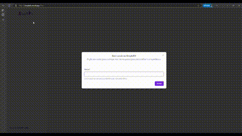

# Bot SimpleFit

Este software foi desenvolvido como parte de um trabalho acadêmico na Universidade Paulista (UNIP), para a disciplina de Projeto de Sistemas Orientados a Objetos. O objetivo do projeto é oferecer suporte aos usuários que desejam montar e gerenciar seus treinos de academia de forma personalizada, utilizando um bot de Inteligência Artificial (IA) avançado.

# Demonstração

# Demonstração

<div align="center">
  
</div>


## Tabela de recursos

| Recursos                                                        | Implementado | Não implementado |
| :--------------------------------------------------------------:| :----------: | :--------------: |
| Criação de múltiplos chats simultâneos                           | ✅           |                  |
| Registro de usuário                                              | ✅           |                  |
| Criação de treinos personalizados com base nas informações do usuário | ✅           |                  |
| Recomendações de dietas                                          |              | ❌               |
| Recomendações de suplementação                                   |              | ❌               |


## ⚙️ Tech Stack

- Next.js
- TailwindCSS
- Vercel AI
- Shadcn UI
- React Hook Form
- Zod

## Variáveis de ambiente

Para rodar o projeto, você precisa configurar as seguintes variáveis de ambiente:

- `AZURE_OPENAI_ENDPOINT`: URL do endpoint da Azure para a IA
- `AZURE_API_KEY`: Chave de API para acessar os serviços da Azure
- `AZURE_RESOURCE_NAME`: Nome do recurso da Azure

## Como rodar o projeto

Siga os passos abaixo para rodar o projeto localmente:

1. Clone o repositório:

   ```bash
   git clone https://github.com/GustavoHenrico/simplefit.git
    ```
2. Navegue até a pasta do projeto:

   ```bash
   cd simplefit
    ```
3. Instale as dependências:

   ```bash
   npm install
    ```
4. Configure as variáveis de ambiente criando um arquivo .env.local na raiz do projeto e adicione as variáveis mencionadas anteriormente.

5. Rode o projeto localmente:

   ```bash
   npm run dev
    ```
6. Abra o navegador e acesse http://localhost:3000 para visualizar o projeto.


## Como contribuir

1. Faça um fork deste repositório.
2. Crie uma nova branch com a sua feature: git checkout -b minha-feature.
3. Commit suas mudanças: git commit -m 'Adiciona nova feature'.
4. Envie para a branch principal: git push origin minha-feature.
5. Abra um pull request.

## Licença

Este projeto é licenciado sob a licença MIT - veja o arquivo LICENSE para mais detalhes.

   ```
    Esse template cobre as instruções básicas, como variáveis de ambiente, como rodar a aplicação e como contribuir.
   ```
